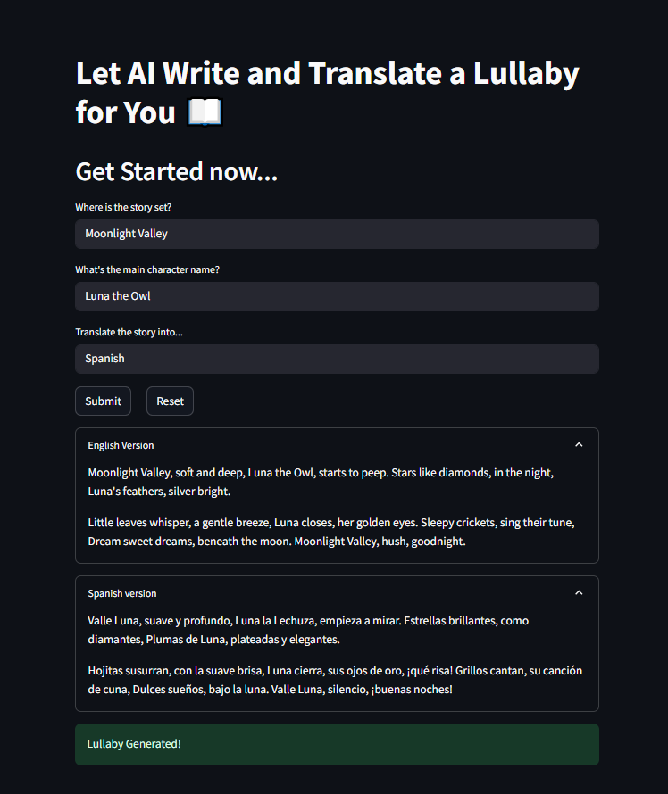

# 🎶 AI Lullaby Generator and Translator

Welcome to the **AI Lullaby Generator and Translator** — a simple yet delightful Streamlit app that creates a short children's lullaby based on your provided **location**, **main character**, and **preferred translation language** using Google's Gemini AI.

---
## 📸 Demo Snapshot



---

## 🚀 Features

- 📚 Generate a simple and short (around 90 words) original lullaby.
- 🌎 Customize the lullaby based on a **location** and **main character name**.
- 🌍 Translate the generated lullaby into any language you choose.
- 🖥️ Beautiful, clean, and interactive web interface using Streamlit.

---

## 🛠️ Tech Stack

- [Streamlit](https://streamlit.io/) - For frontend UI.
- [LangChain](https://www.langchain.dev/) - Chaining prompts and LLM operations.
- [Google Gemini 1.5 Pro](https://ai.google.dev/) - The LLM behind the creative generation.
- [Python-Dotenv](https://pypi.org/project/python-dotenv/) - Managing environment variables.

---

## 🛠️ Installation & Setup

1. **Clone the repository:**
   ```bash
   git clone https://github.com/AI-Agents-Level-1/ai-lullaby-generator.git
   cd ai-lullaby-generator

## Install the required dependencies:
`pip install -r requirements.txt`

## Set up your environment variables:
- Create a .env file in the root directory.
- Add your Google API key inside it:
`GEMINI_API_KEY=your-google-api-key-here`

## Run the Streamlit app:
`streamlit run app.py`

---

## 📂 Project Structure

├── app.py                  # Main Streamlit application
├── requirements.txt         # Python dependencies
├── .env                     # Environment variables (not pushed to GitHub)
├── README.md                # Project documentation
└── assets/
    └── demo_snapshot.png    # App demo screenshot

---

## 📜 License
This project is licensed under the MIT License — feel free to use, modify, and share it!