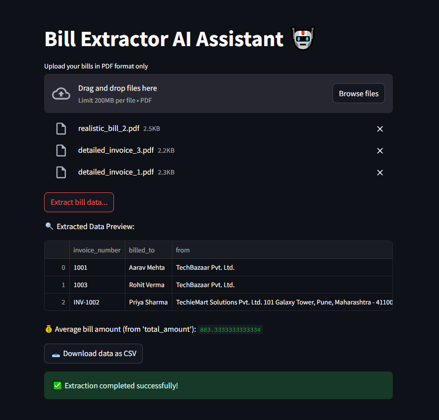

# 🧾 Bill Extractor AI Assistant

Welcome to the **Bill Extractor AI Assistant** — a smart and efficient Streamlit application that uses **Google Gemini AI** to automatically extract structured billing data from uploaded PDF invoices.

---

## 📸 Demo Snapshot



---

## 🚀 Features

- 📄 Upload one or multiple **PDF invoices** at once.
- 🤖 Extract fields like **invoice number, billed to, total amount, item list**, and more.
- 📊 Automatically calculate the **average bill amount** if total values are found.
- 📥 Download the structured results as a **CSV file**.
- 🌐 Clean and interactive interface built with **Streamlit**.

---

## 🧰 Tech Stack

- [Streamlit](https://streamlit.io/) — For the front-end web interface.
- [LangChain](https://www.langchain.dev/) — For prompt chaining with the Gemini LLM.
- [Google Gemini 1.5 Flash](https://ai.google.dev/) — The LLM powering the invoice parser.
- [PyPDF](https://pypi.org/project/pypdf/) — To extract raw text from PDFs.
- [Pandas](https://pandas.pydata.org/) — To handle tabular data.
- [Python-Dotenv](https://pypi.org/project/python-dotenv/) — For environment variable management.

---

## ⚙️ Installation & Setup

### 1. Clone the repository

```bash
git clone https://github.com/AI-Agents-Level-1/bill-extractor-ai.git
cd bill-extractor-ai
```

## Install the required dependencies:
`pip install -r requirements.txt`

## Set up your environment variables:
- Create a .env file in the root directory.
- Add your Google API key inside it:
`GEMINI_API_KEY=your-google-api-key-here`

## Run the Streamlit app:
`streamlit run app.py`

---

## 📂 Project Structure

bill-extractor-ai/
├── app.py                  # Main Streamlit interface
├── helpers.py              # Core logic: PDF parsing, LLM calls, data formatting
├── requirements.txt        # Python dependencies
├── .env                    # API key (not pushed to GitHub)
├── README.md               # Project documentation
└── assets/
    └── invoice_example_pdfs
    └── demo_snapshot.png

---

## 📜 License
This project is licensed under the MIT License — feel free to use, modify, and share it!