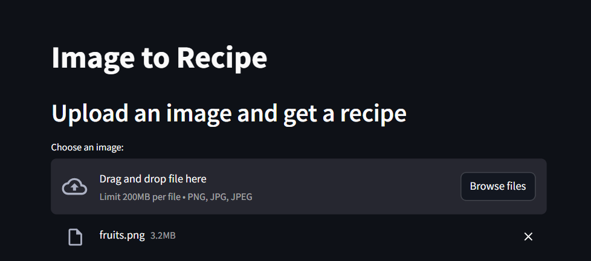
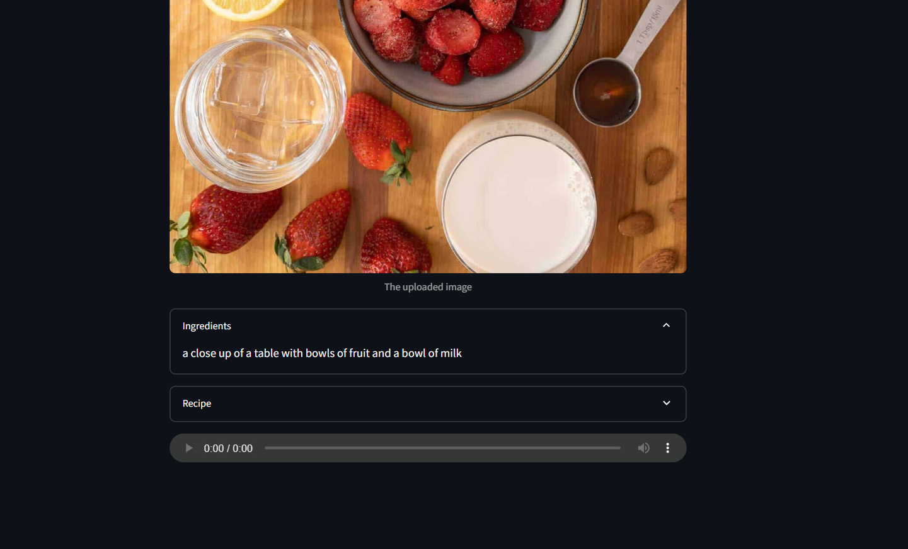

# 🥗 Image to Recipe AI App

This project takes an uploaded image of food or ingredients and generates a healthy, quick recipe using AI. It uses image captioning to understand what's in the image, a generative LLM to suggest a recipe, and TTS to narrate the image caption.

---

## 📸 Demo Snapshot




---


## 🚀 Features

- 📸 **Image Captioning** – Detect ingredients or food items from an image using HuggingFace's BLIP model.
- 🍽️ **Recipe Generation** – Uses Google's Gemini Pro model (via LangChain) to generate a healthy recipe.
- 🔊 **Text to Speech** – Converts the image description to audio using HuggingFace's TTS model.
- 🧠 **Smart Prompting** – Prompt designed for a knowledgeable AI nutritionist/bodybuilder/chef.
- 🖼️ **Streamlit UI** – Simple, interactive interface to upload images and get results.

---

## 📦 Tech Stack

- Python 3.9+
- [LangChain](https://python.langchain.com/)
- [Google Generative AI (Gemini)](https://ai.google.dev/)
- HuggingFace Transformers
- Streamlit for UI
- dotenv for key management

---

## 📝 Setup Instructions

### 1. Clone the Repository

```bash
git clone https://github.com/neurontist/image-to-recipe.git
cd image-to-recipe
```

### 2. Create Virtual Environment & Install Requirements
```
python -m venv venv
source venv/bin/activate  # On Windows: venv\Scripts\activate
pip install -r requirements.txt
```

### 3. Create a .env file
```
GEMINI_API_KEY=your_google_generative_ai_key
HUGGING_FACE_AGENT_TOKEN=your_huggingface_token
```

### 4. Run the App
```
streamlit run app.py
📁 File Structure

.
├── app.py                  # Main Streamlit app
├── .env                   # Environment variables (not checked into Git)
├── requirements.txt        # Python dependencies
├── README.md               # This file
```

### 📸 Sample Workflow

* Upload an image (e.g., fruits, vegetables, ingredients).

* App generates:

1. Image caption (ingredients).

2. AI-generated healthy recipe.

3. Audio narration of the caption.

### 🔐 API Keys Required
Google Generative AI (Gemini) – Get an API key

HuggingFace Token – Create access token

### 💡 Future Improvements
* Recipe PDF export

* Multilingual TTS

* Calorie/macronutrient analyzer using image classifiers

* Meal plan generation from multiple images

### 🙏 Acknowledgements
* HuggingFace
* LangChain
* Google GenAI
* Streamlit
